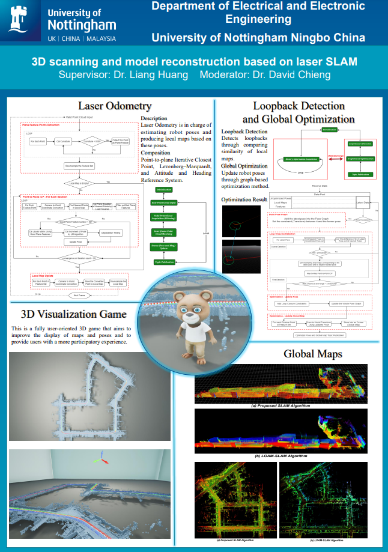
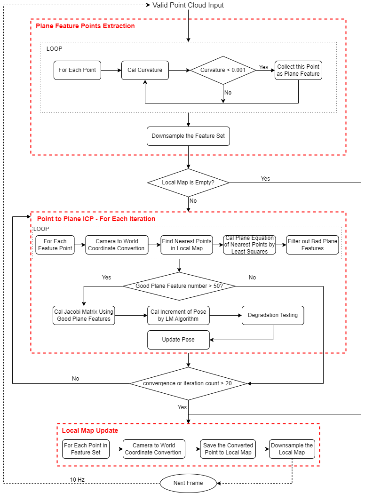
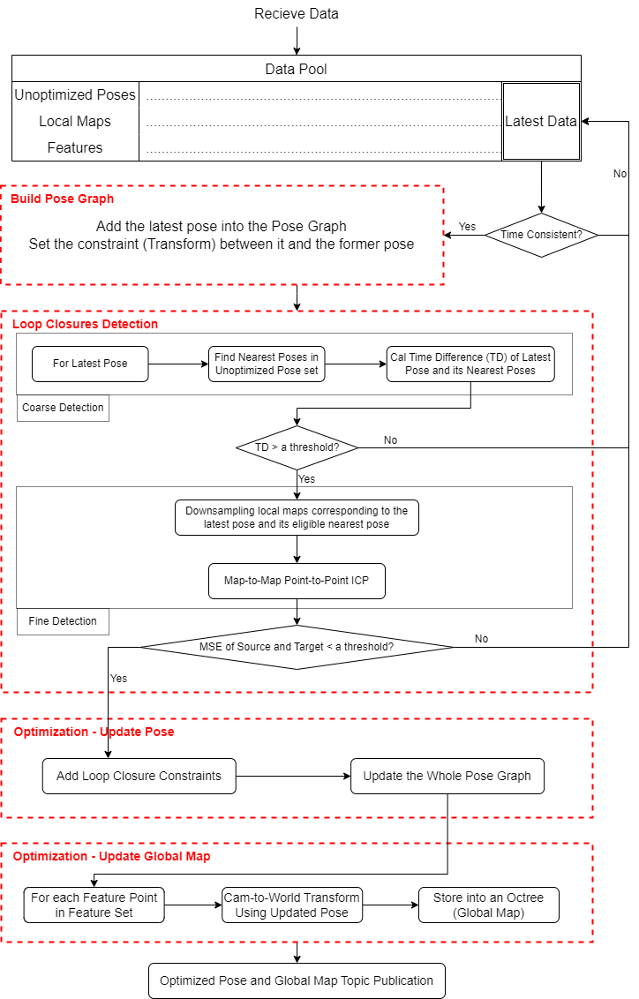
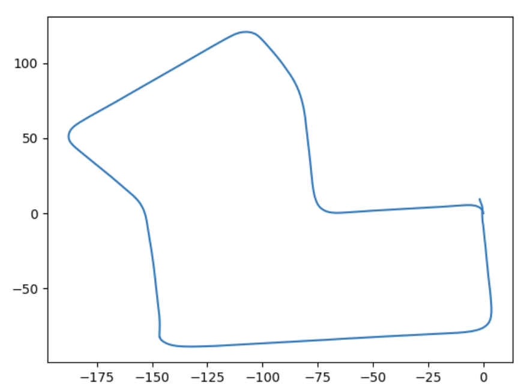
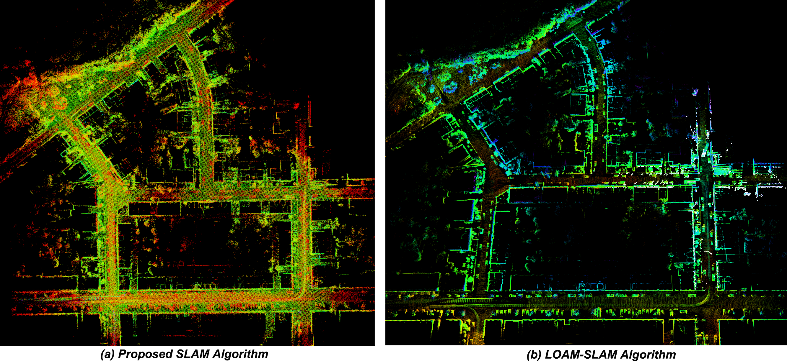
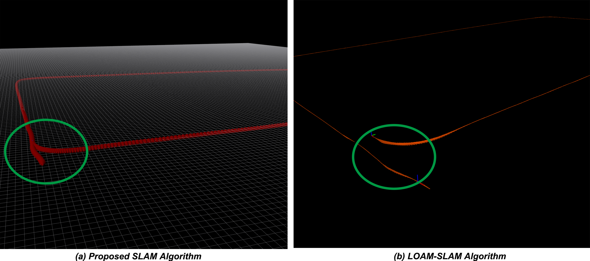
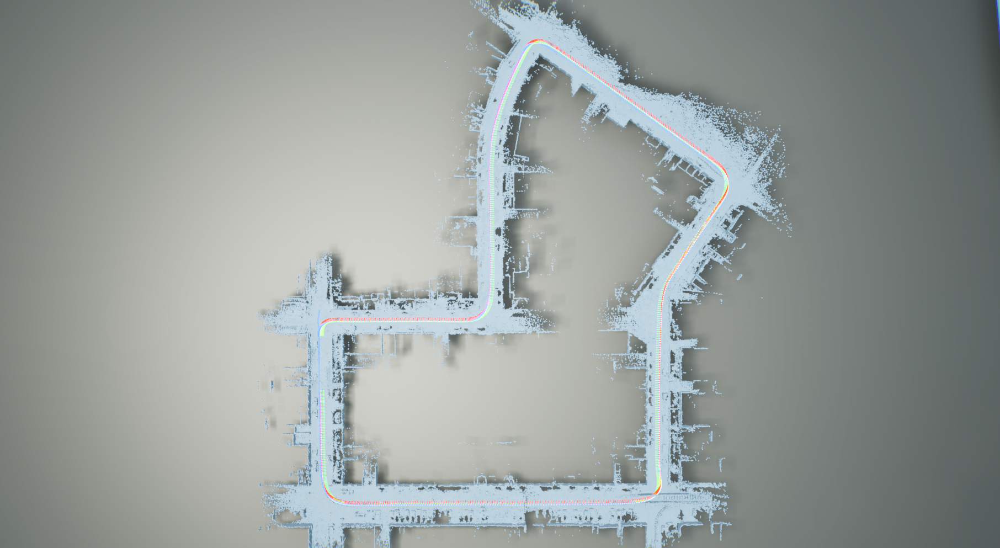
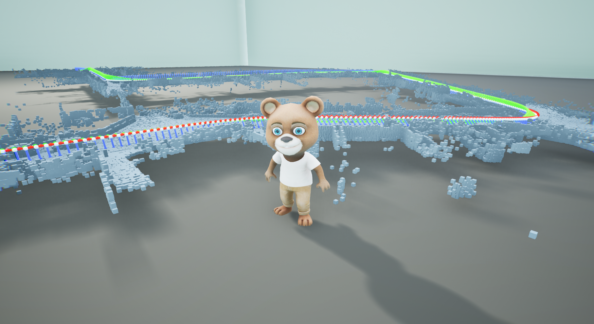
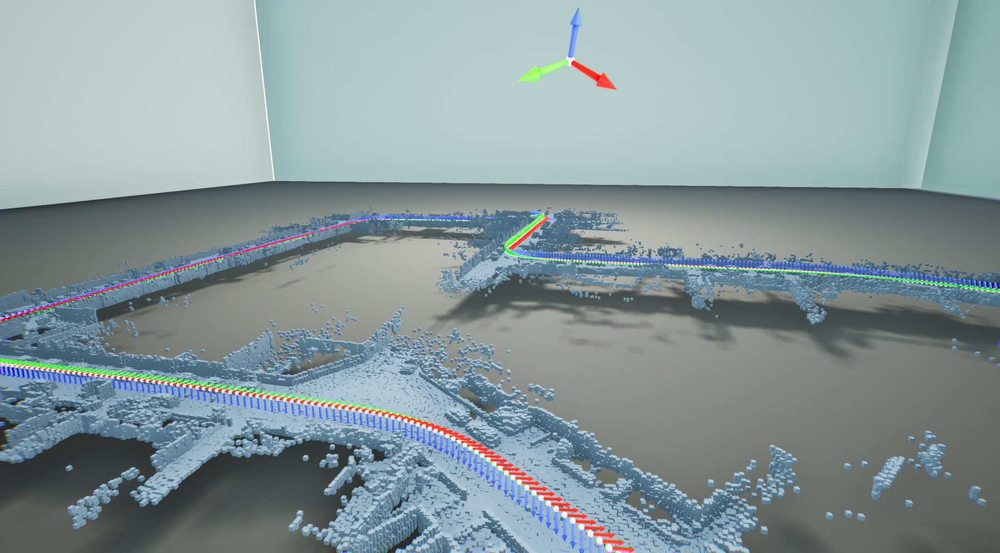

# SLAM
A 3D scanning and model reconstruction algorithm based on laser SLAM (Simultaneous Localization and Mapping). In this project, a real-time SLAM algorithm based on LiDAR sensor is implemented and applied to the 3D scanning and model reconstruction system. This algorithm can be divided into three parts, including laser odometry (front end), loop closure detection and global optimization (back end). The laser odometry is achieved by applying the Point-to-plane Iterative Closest Point (ICP) algorithm and the Levenberg–Marquardt (LM) algorithm, and it is fused with the Attitude and Heading Reference System (AHRS). Loop closure detection is based on the map-to-map ICP algorithm, and the global optimization is accomplished through the graph-based optimization algorithm. In addition, a 3D UE5 game for visualization is implemented.
##### Note: A detailed description of the algorithm and the results can be found in ```UNNC-FYP-20215854.pdf```.

## Tech Stack
1. C++
2. ROS2
3. UE5

## Poster


## Design
### Front-end


### Back-end


## Visualization
### Dataset
[KITTI Odometry Dataset](https://www.cvlibs.net/datasets/kitti/eval_odometry.php) (Velodyne laser data) with sequence number 07, which is a road scene. Ground Truth:


### RViz



### Unreal Engine 3D Game Display



